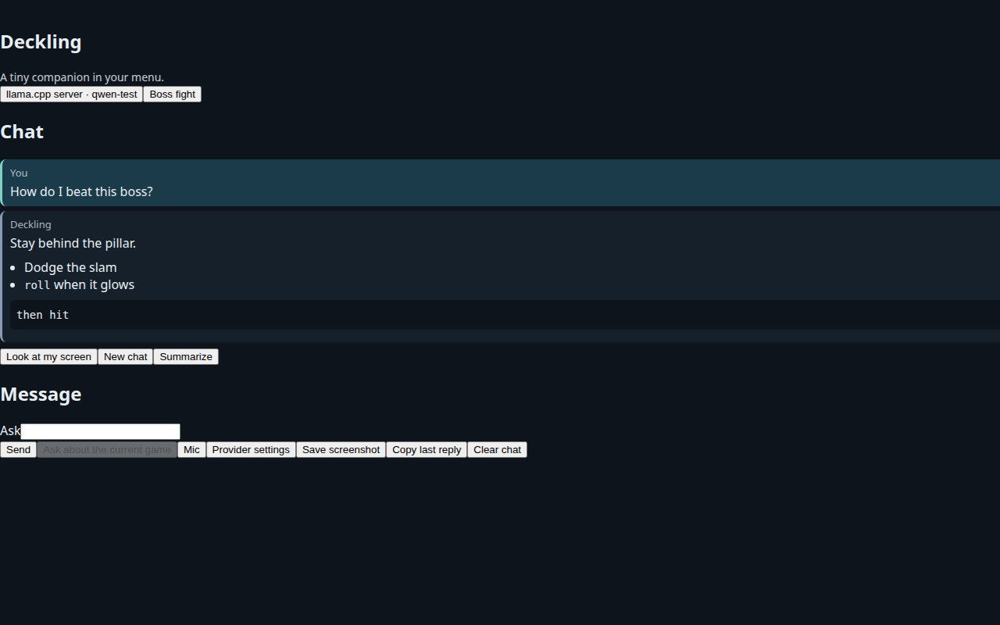
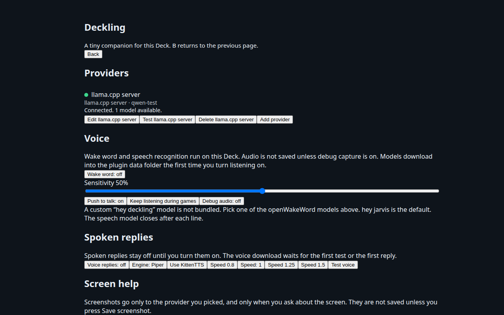

# Deckling

Deckling is a tiny AI companion that lives in your Steam Deck. It is a [Decky Loader](https://github.com/SteamDeckHomebrew/decky-loader) plugin: connect a provider and chat from the Quick Access Menu while a game is running.


The frontend uses the current Decky libraries: `@decky/ui` (the package that replaced `decky-frontend-lib`) and `@decky/api`. The backend is Python (`main.py`) and follows the official plugin layout so the Decky CLI can build an installable zip.

## Screenshots

These are headless renders at 1280×800 with the Decky controls mocked. A capture from a real Deck is still to come.

| Quick Access chat | Provider settings |
| --- | --- |
|  |  |

The chat shows the provider and model on one button, the conversation, and Look at my screen, New chat, and Summarize. Settings groups Providers, Voice, Spoken replies, Screen help, Privacy, and Advanced. Text entry stays in a dialog. The top of settings says whether the backend is connected. A startup failure shows the traceback there under Details. Advanced, Diagnostics can copy the recent log or save it as `~/Deckling-diagnostics.txt`. The same traceback is written to `~/homebrew/logs/Deckling/boot-error.txt`.

## Install

This plugin is **not in the Decky plugin store yet**.

### Install Plugin from URL

This is the path Decky's **Install Plugin from URL** button expects. The release asset is always named `Deckling.zip`, so this address keeps working after each stable release:

`https://github.com/SMwaterSHLDhelp/Deckling/releases/latest/download/Deckling.zip`

1. Install Decky Loader from [decky.xyz](https://decky.xyz) if you have not already.
2. In Game Mode, open the Quick Access Menu and the Decky icon.
3. Open the settings gear, then **Developer**.
4. Choose **Install Plugin from URL**.
5. Paste the address above and confirm.
6. If the plugin does not show up, restart Decky from that same menu. It appears as **Deckling**.

`/releases/latest/` is the newest GitHub Release that is not a prerelease. That link starts working when `v0.1.0` is published. A test build cut from a branch uses a prerelease tag, and its zip is the asset on that prerelease, not this `latest` URL.

The zip has one top-level folder, `Deckling` (the `name` in `plugin.json`). Inside it are `plugin.json`, `dist/index.js`, `main.py`, `package.json`, and `LICENSE`, plus the Python package and the README. Decky installs that folder under `~/homebrew/plugins/`. Decky identifies a plugin by that folder name, so this zip does not replace a folder left over from the earlier name.

### If you already installed the earlier build

The earlier build is a different plugin entry. Its folder is `~/homebrew/plugins/AI Assistant`, and the Decky plugin list keeps showing that name until you uninstall it. Installing `Deckling.zip` adds `~/homebrew/plugins/Deckling` beside it. It does not rename the old folder.

On first start, Deckling copies `credentials.json` and `sessions.json` from the old folders when the new files are not there yet. Your providers and chats should appear in Deckling. Then uninstall the old entry:

1. Open the Decky plugin list.
2. Uninstall the entry still named **AI Assistant**. Leave **Deckling** installed.
3. Restart Decky if the old name is still in the list.

Uninstalling the old entry deletes that entry's own settings folder. Do it only after Deckling shows your providers. Copying does not run again once Deckling already has a `credentials.json`. Overwriting the old folder in place also leaves the old list entry, because the folder name is what Decky loaded. Install the new zip, confirm your providers, then uninstall the old entry.

### Install Plugin from ZIP

1. Download `Deckling.zip` from a [GitHub Release](https://github.com/SMwaterSHLDhelp/Deckling/releases) or from the artifact on a successful Actions run.
2. Copy the zip to your Deck (a USB drive, SSH, or the browser download folder all work).
3. Open the same **Developer** menu.
4. Choose **Install Plugin from ZIP** and select `Deckling.zip`.
5. Restart Decky if the plugin does not appear.

You can also unzip it so this folder exists:

```text
~/homebrew/plugins/Deckling/
  plugin.json
  package.json
  main.py
  LICENSE
  README.md
  dist/index.js
  py_modules/
```

Restart Decky after copying the folder. The folder name inside the zip is `Deckling`, which is the name in `plugin.json`.

## Building from source

You need Node.js 20 or newer and [pnpm](https://pnpm.io) 9. The Decky builder image runs `pnpm i --frozen-lockfile` with pnpm 9, so keep the lockfile in that format. Python 3.11 or newer is enough for the tests; the Deck uses the Python that ships with Decky Loader, and this plugin stays in the standard library.

```bash
corepack enable
corepack prepare pnpm@9.15.9 --activate
pnpm install
pnpm run build          # frontend -> dist/index.js
pnpm run typecheck
pnpm run lint
python3 -m pip install -r requirements-dev.txt
ruff check main.py py_modules tests bridge scripts
pytest
```

The installable zip is produced by the Decky CLI, which builds the frontend inside the official builder image (Docker or Podman):

```bash
# https://github.com/SteamDeckHomebrew/cli/releases
decky plugin build -o ./out
```

That writes `out/Deckling.zip` (the Decky CLI uses the name from `plugin.json`). The GitHub Actions workflow uploads that file as `Deckling.zip`, and on tags `v*` it attaches that exact filename to the GitHub Release. The release notes are the matching section of [CHANGELOG.md](CHANGELOG.md). A tag that contains a hyphen, such as `v0.1.0-rc.1`, is published as a prerelease so it does not replace `/releases/latest/`. See [`.github/workflows/build.yml`](.github/workflows/build.yml).

`pnpm run build` alone is enough to refresh `dist/` while you are developing. Decky only loads the zip layout above, not the TypeScript sources.

## Provider setup

Add a provider from the Quick Access panel's **Provider settings** button. Name, URL, and key open in their own dialog so the on-screen keyboard stays on the field you are typing. Save needs a name and a type, plus a key or a URL. The model can stay blank; Save then loads that server's models into the dialog. **Test connection** calls the provider's model-list endpoint and does not send a chat prompt. Pick a default provider and model on that page. The chat panel can override the model for the current session.

API keys and OAuth tokens are stored in Decky's plugin settings directory (`credentials.json`, mode `0600`). The file is not world-readable, and secrets are redacted before anything is written to the plugin log. Leave a key field blank while editing to keep the saved value.

### OpenAI / ChatGPT

**API key (supported path for third-party apps).** Create a key at [platform.openai.com](https://platform.openai.com/api-keys). The default base URL is `https://api.openai.com/v1`. That is the normal way to call GPT models from this plugin. You pay through the OpenAI API, not through a ChatGPT Plus subscription.

**OAuth.** OpenAI publishes a real device-code flow and an authorization-code + PKCE flow at `https://auth.openai.com`. Both are implemented:

- Device code: `POST /api/accounts/deviceauth/usercode`, then poll `/api/accounts/deviceauth/token`, then exchange at `/oauth/token`. The verification page is `https://auth.openai.com/codex/device`.
- PKCE: the browser is sent to `/api/accounts/authorize` and redirects to `http://127.0.0.1:8137/auth/callback`. Register that exact redirect URI on your OAuth client.

You must paste an OAuth **client ID** that OpenAI has registered for you. This plugin does **not** embed the Codex CLI's client ID and does not pretend to be Codex. OpenAI does not give arbitrary third-party apps a client that spends a ChatGPT Plus or Pro quota. A Sign in with ChatGPT token is often an identity token and may be rejected by `api.openai.com`. **Test connection** shows that error as-is. If you do not have your own client ID, use an API key.

### Anthropic Claude (API key)

API key only, from [console.anthropic.com](https://console.anthropic.com/). The default base URL is `https://api.anthropic.com`. You pay per token.

Anthropic does not offer OAuth for third-party apps that call this API. The login used by Claude.ai and Claude Code is first-party. This provider does not imitate that login and has no OAuth button.

### Claude Code (subscription)

This is the path for a **Claude Pro, Max, Team, or Enterprise** subscription, the same login Claude Code uses. It does not use an Anthropic API key and it does not bill per token. The plugin runs the official `claude` CLI (`claude -p --output-format stream-json`, with `--model` and `--resume` for the conversation). It does **not** reimplement Anthropic's OAuth and it does not send the subscription token to a private API itself.

Use of this provider is subject to [Anthropic's terms for Claude Code](https://code.claude.com/docs/en/legal-and-compliance). Each person signs in with their own Claude account. The plugin does not bundle Claude Code and does not implement a Claude.ai login of its own: it runs the unmodified `claude` binary, and a subscription login can only do what that plan allows.

Model choices are the CLI aliases `sonnet`, `opus`, and `haiku`. You can also type a full model id if your CLI accepts it. Rate limits and usage limits from the subscription are shown in the chat as their own message, not as a generic failure.

**On the Deck.** Install Claude Code from the [official setup page](https://code.claude.com/docs/en/setup) (the native installer, or `npm install -g @anthropic-ai/claude-code`). Leave **Bridge URL** empty. Either:

- run `claude login` in a terminal on the Deck, or
- save the provider, then press **Sign in with setup-token**. The plugin runs `claude setup-token`, shows any URL or code the CLI prints, and stores the token it prints in `credentials.json` (mode `0600`). That token is passed to the CLI as `CLAUDE_CODE_OAUTH_TOKEN`. You can also paste a token from a computer where you already ran `claude setup-token`.

If `claude` is not on `PATH`, **Test connection** explains how to install it. Tools are disabled for these chats (`--tools ""`), so the CLI is used as a conversation, not as an agent that edits files on the Deck.

**On a PC, for Decks without Node.** From a clone of this repo, on the computer that has Claude Code installed and signed in:

```bash
export CLAUDE_BRIDGE_SECRET="$(python3 -c 'import secrets; print(secrets.token_urlsafe(32))')"
python3 bridge/deckling_bridge.py --host 0.0.0.0 --port 8765
```

Sign in on that PC with `claude login` or `claude setup-token` before chatting. In the plugin, set **Bridge URL** to `http://<that-pc-lan-ip>:8765` and put the same secret in **Bridge shared secret**. The script only wraps `claude -p` and checks the secret. It does not log the secret or the prompt. Keep it on your LAN.

The bridge is not inside the Decky zip. Copy `bridge/deckling_bridge.py` from this repository. `bridge/claude_bridge.py` is the same program, so an older command still runs. It accepts `Authorization: Bearer`, `X-Deckling-Secret`, and the older `X-AI-Assistant-Secret` header.

### xAI Grok

xAI's official OpenAI-compatible API. The default base URL is `https://api.x.ai/v1`. Chat uses streaming `POST /v1/chat/completions`. **Test connection** calls `GET /v1/models`. The default model is `grok-4.7`. This plugin does not call grok.com or other unofficial endpoints.

**API key.** Create one in the [xAI console](https://console.x.ai/). That is the path that bills the API.

**Device-code sign-in (SuperGrok or X Premium+).** xAI publishes an OAuth authorization server at `https://auth.x.ai`. Its [OpenID discovery document](https://auth.x.ai/.well-known/openid-configuration) lists a device-code endpoint, the device-code grant, refresh tokens, and public clients (`token_endpoint_auth_methods_supported` includes `none`, so there is no client secret). The plugin uses that device flow with xAI's public Grok CLI client id, the same client [Hermes Agent](https://github.com/NousResearch/hermes-agent/blob/main/website/docs/guides/xai-grok-oauth.md) documents for its xAI Grok OAuth provider. Scopes are the published set `openid profile email offline_access grok-cli:access api:access`. Tokens are stored in `credentials.json` (mode `0600`) and refreshed with the refresh token.

Press **Sign in with device code**, open the page, and enter the code. No OAuth client id or secret is required from you.

xAI decides which subscriptions can call the API this way. Hermes has seen HTTP 403 for some SuperGrok tiers after a successful browser login. If that happens, use an API key instead. The chat error says so.

### Google Gemini

**API key (recommended).** Create one in [Google AI Studio](https://aistudio.google.com/apikey). The default base URL is `https://generativelanguage.googleapis.com/v1beta`. An API key is the smaller permission grant.

**OAuth, if you want it.** Google documents both a [limited-input device flow](https://developers.google.com/identity/protocols/oauth2/limited-input-device) and installed-app PKCE. This plugin implements both, using a client you create in Google Cloud:

1. Enable the Generative Language API on the project.
2. Create an OAuth client. Use **TVs and Limited Input devices** for the device-code button (that type has a client secret; paste both the client ID and the secret). Use a **Desktop** client for the PKCE button.
3. For PKCE, register the redirect URI `http://127.0.0.1:8138/`.

Google's own Gemini OAuth quickstart requests the `cloud-platform` scope because `generateContent` has no narrower public scope, plus `generative-language.retriever`. This plugin requests those same scopes. That is a broad Google Cloud scope. Prefer an API key unless you specifically need OAuth.

### Nous Hermes

Hermes is reached through an OpenAI-compatible endpoint. The default is OpenRouter:

- Base URL: `https://openrouter.ai/api/v1`
- API key from [openrouter.ai/keys](https://openrouter.ai/keys)
- Default model: `nousresearch/hermes-4-70b` (the model list prefers ids that contain `hermes`; `nousresearch/hermes-4-405b` is the larger option)

OpenRouter does not offer a third-party OAuth flow for this. Use the API key.

To point at another Hermes host (a local vLLM, llama.cpp, or another OpenAI-compatible server), change the base URL. The path must include `/v1` when that server uses the OpenAI layout (`.../v1/chat/completions`).

### Ollama

No account. Set the base URL to the daemon, on the Deck or on your LAN:

- This Deck: `http://127.0.0.1:11434`
- Another computer: `http://192.168.x.x:11434`

Models come from `GET /api/tags`. Chat uses `POST /api/chat` with streaming. An API key is optional and only needed if you put a proxy in front of Ollama. Install Ollama on the Deck or on a PC, run `ollama serve`, and `ollama pull` a model before testing.

### llama.cpp server

On the computer that has the GGUF (a PC on your LAN, or the Deck itself):

```bash
llama-server -m model.gguf --host 0.0.0.0 --port 8080
```

`--host 0.0.0.0` is what lets the Deck reach a server running on another machine. Port 8080 is llama.cpp's default. If the Deck cannot connect, allow inbound TCP 8080 on that PC's firewall (Windows Defender Firewall, ufw, or the router, depending on where the server runs).

In the plugin, either base URL works:

- `http://192.168.x.x:8080`
- `http://192.168.x.x:8080/v1`

Use `http://127.0.0.1:8080` when llama-server is running on the Deck. Leave the model blank when the server has a single GGUF loaded; the plugin uses the id from `GET /v1/models`. If several models are loaded, pick one. If you started the server with `--api-key`, put that same value in the API key field. Otherwise leave the key blank.

While the model is still loading, llama-server answers HTTP 503. The plugin tells you to wait and try the connection again. A server that is not running, or a firewall that drops the port, is reported as a connection failure rather than a raw system error.

### Custom OpenAI-compatible

Same protocol as llama.cpp and OpenRouter: a base URL ending in `/v1`, optional bearer token, `GET /models`, and streaming `POST /chat/completions`. Use this for vLLM, LM Studio's local server, or any other compatible endpoint.

## Using the chat

Open **Deckling** in the Quick Access Menu.

- Pick a provider, then pick a model from the list the server returns (Ollama `/api/tags`, OpenAI-compatible `/v1/models`, and the same list for xAI, Gemini, and the other backends). Saving a provider, or changing its URL or key and saving again, loads that list. **Refresh models** loads it again. You can still type a model id if the server did not list it.
- The text field is a Steam `TextField`, so it opens the on-screen keyboard. Send is a button, so you do not need a physical keyboard.
- Replies stream in as the backend emits Decky events.
- **Ask about the current game** reads the running game's name from Steam (`Router.MainRunningApp`) and includes it in that message. The button stays disabled when nothing is running. An empty message with that button asks for a short spoiler-free tip.
- **Copy** uses Steam's clipboard when it is available.
- **New chat** starts another conversation for the game that is running, or a General chat when nothing is running. Opening the menu while a game is running switches to that game's most recent chat.
- **Chats** lists the current game first, then other games, then General. Each row shows the name, a preview of the last message, and when it was updated. Open, rename, pin, move to another game, or delete. Rename uses its own text field so the Steam keyboard stays on that field. A new chat is named from the first question. You can rename it afterward.
- The last provider and model used in a chat are restored when you open it again. **Remember model per chat** in Advanced turns that off. **Keep chats** is 20, 40, or 80. Pinned chats are kept when older ones are removed. Each chat is a separate file under the plugin data directory, mode `0600`. Chats from an older install are copied into that layout on first start.
- **Clear chat** deletes the messages in the current conversation. **Summarize** summarizes the chat that is open. Game context and web lookup follow the game that is running, on whichever chat is open.
- Only one reply streams at a time. **Stop** cancels it. **Stop** also stops a spoken reply.

Each request also includes the system prompt from settings, if you set one. The model sees the latest 40 messages.

While a game is running, a **Now playing** card sits at the top of the chat: capsule art when the store has it, the game name, the rich presence line, and achievements as x/y. Suggested prompts under the chat follow that game, for example where to go next or how to unlock the next achievement. **Ask about the current game** still puts the Steam name in that one message, because you pressed the button.

The same snapshot is turned into a compact **Game context** block on the system prompt for each turn, and on a screen-help turn, when sharing is on. Only fields that were actually read are included. The block refreshes when the game, the ROM command line, the rich presence line, or the achievement count changes. Store details are cached per app id under the plugin data directory (`game-cache/`, mode `0600`) for seven days.

What the plugin can actually read:

| Source | What it provides | How sure |
| --- | --- | --- |
| `Router.MainRunningApp` and the app overview | App id, name, playtime, last played, shortcut flag, executable, launch options | Used for the card and the prompt. Covered by tests with a mocked overview. |
| Shortcut command line | ROM title for RetroArch, EmuDeck, and similar emulators | Parsed locally. Covered by tests. A title that is not a path with a known ROM extension is left as the shortcut name. |
| Store `appdetails` | Genres, short description, developer, capsule image | Fetched when the Deck can reach `store.steampowered.com`. Cached on success. A failed request is not cached, so the next game change tries again. Shortcuts are not looked up. |
| Steam guides and PCGamingWiki | A guides URL, or a wiki search URL | The links are built from the app id or title. The pages themselves are not downloaded. |
| `SteamClient` rich presence, achievements, Proton tool, recent screenshot | Status string, unlocked/locked counts, compat tool name, whether a recent screenshot exists | Best effort. The panel tries the method names current Steam builds have used and ignores a missing method. There is no Steam web API key, so the global achievement schema is not downloaded. If the client does not return achievements, that part of the prompt is omitted. |
| Web lookup | Search snippets and readable page text, with source links | On by default. DuckDuckGo HTML needs no key. A SearXNG URL, or a Brave, Tavily, or Serper key, can be set under Privacy. Results are cached for a day under `web-cache/`. Requests pause briefly per site, stop at a few hundred kilobytes, and skip pages whose robots.txt disallows them. Fandom, wiki.gg, PCGamingWiki, and Steam results are ranked first. There is no headless browser. |

OpenAI, Claude, Gemini, Grok, and llama.cpp or Ollama models that accept tool calls can run `web_search` and `fetch_page` themselves. The chat shows **Searching the web…** while that happens. Models that do not accept tools get an automatic search for the current game plus your question, and the excerpts go into the prompt. Either way, the pages that were used show up as small links under the answer. **Web lookup** in Privacy turns this off. Search keys stay in `credentials.json` and are not written to the log.

## Voice replies

Spoken replies are off until you turn them on in settings. Two engines are available:

- **Piper** is the default. The first test or spoken reply downloads the Piper program and the voice you picked into Decky's data directory for this plugin. Nothing is added to the plugin zip. The English voices are Lessac, Amy, Ryan, Alan, and Jenny Dioco, all medium quality. Lessac is the default.
- **KittenTTS** is the second engine. It installs its wheel into a virtual environment in that same data directory and downloads the nano int8 model on first use. Voices are Bella, Jasper, Luna, Bruno, Rosie, Hugo, Kiki, and Leo. Jasper is the default. If SteamOS cannot create that environment or install the wheel, KittenTTS is disabled with the reason, and Piper keeps working. **Try KittenTTS again** repeats the install.

Each engine has its own voice buttons, a speed of 0.8, 1, 1.25, or 1.5, and **Test voice**. Audio is played through the Deck user's PipeWire or PulseAudio session (`XDG_RUNTIME_DIR` and `PULSE_SERVER`). Sending a message, starting a new chat, or pressing **Stop** / **Stop speaking** interrupts playback. A KittenTTS process that is still resident is closed after it has been idle, so the model is not kept in memory. Piper exits after each line, which releases its model too.

A speech failure does not fail the chat. The text reply still appears.

## Listening

Wake word and speech recognition are off until you turn **Wake word** on in settings. A custom “hey deckling” model is not included. The choices are the openWakeWord models hey jarvis (the default), alexa, hey mycroft, and hey rhasspy. A sensitivity slider trades missed wake-ups against false ones. **Push to talk** stays available when the wake word is off: the Quick Access button, and Steam + X (guide + X) when that controller API exists. Steam + Y stays the screen chord.

The first time you enable the wake word, or hold push to talk, the plugin downloads models into Decky's data directory. They are not inside `Deckling.zip`.

- The wake word runs in its own process at a lower priority, using openWakeWord 0.4 on ONNX. Later openWakeWord releases need `tflite-runtime`, which has no wheel for SteamOS's current Python, so those releases are not installed. Feature models download with the wake-word file.
- Speech recognition tries faster-whisper on CPU at int8, with `tiny.en` or `base.en`. If that wheel cannot be installed on SteamOS, the plugin installs a whisper.cpp build instead and says so in settings. Push to talk still works when the wake word itself cannot be installed.
- Recording uses the Deck user's PipeWire or PulseAudio session (`parec`, `pw-record`, or `pw-cat`), including when Deckling's backend is root. Each line ends after a short silence. The speech process exits after that line, so the model is not kept in memory.
- Listening pauses while the Deck is asleep. **Pause while a game is running** does the same during a game. The Quick Access row shows whether the mic is listening, hearing you, transcribing, paused, or off.

After the chime, the transcript is sent to the provider you selected. While the assistant is waiting for a go-ahead, you can say "go ahead", "yes", or "do it" to confirm, and "cancel" or "stop" to cancel. "New chat" and "stop listening" work by voice. Phrases such as "what am I looking at" still use screen help.

## Looking at the screen

Ask "how do I do this", "what am I looking at", "help me with this", or "what should I do here" (and a few close variants such as "look at my screen"). You can also press **Look at my screen**. On a Deck whose Steam client exposes controller registration, Steam + Y (guide + Y) does the same thing. If that API is missing, the button still works.

The panel closes the Quick Access Menu first so the overlay is not in the picture, waits a moment, and then tries Steam's screenshot functions (`SteamClient.Screenshots` and `SteamClient.GameSessions`). The backend then tries, in order:

1. gamescope's control socket (`screenshot <path>` on a `gamescope*` socket in `XDG_RUNTIME_DIR`)
2. a gamescope PipeWire video node (`pw-dump`, then one frame)
3. a new `gamescope*.png` or `steam*.png` file under `/tmp`

The picture is resized so the long edge is about 1280 pixels and compressed to JPEG. It is sent with your question and the running game's name to the provider you selected, as a vision input:

- OpenAI, xAI Grok, llama.cpp, and custom OpenAI-compatible servers get an `image_url` data URL
- Anthropic gets a base64 image block
- Gemini gets inline JPEG data
- Ollama gets an `images` array (llava, qwen-vl, and similar)

Models that can take an image are marked **sees the screen** in the model list. If the selected model is text-only, the plugin says so and offers models from that server that can see the screen. Claude Code on the Deck cannot take a screenshot from this plugin; switch to another provider for screen help.

The answer uses a short Jarvis-style prompt: a few spoken sentences, friendly, and specific to the game on screen. It does not use your normal system prompt and it does not resend the whole chat. When voice replies are on, that answer is spoken.

**Screen capture** in settings turns the feature off. Screenshots are sent only to the provider you chose. They are kept in memory for **Save screenshot** and are otherwise not written to disk. Saved copies go in the plugin data directory under `saved-screenshots/`. Temporary capture files under `/tmp` are removed. Steam's own screenshot folder is not deleted.

## Privacy

- Chat text is sent only to the provider URL you configured. This plugin has no separate telemetry server.
- **Share game context with AI** is on by default. While it is on, the Game context block goes to that same provider with each message. **Include achievements** and **Include playtime** drop those fields from the prompt. The Now playing card on this Deck can still show them. Turning sharing off removes the block. Store cache files stay on the Deck.
- A screen-help screenshot is sent only to that same provider, only when you ask about the screen, and only if screen capture is enabled. It is not written into `sessions.json`. It stays on disk only if you press **Save screenshot**.
- The microphone stays on this Deck. Wake-word scores and transcripts are computed locally. Audio is discarded after each line unless **Debug audio** is on. Those recordings are mode `0600` under the plugin data directory.
- API keys, OAuth client secrets, access tokens, and refresh tokens live in `credentials.json` under Decky's settings directory for this plugin. The directory is mode `0700` and the file is mode `0600`.
- Conversations live in `sessions.json` under Decky's runtime data directory, also mode `0600`.
- Logs record the provider type, model id, and status. A log filter redacts bearer tokens, `sk-` keys, Google API keys, and similar strings. Authorization headers are not logged. OAuth callback URLs are not logged, because they contain one-time codes.
- Uninstalling the plugin deletes `credentials.json` and `sessions.json`.
- OpenRouter, OpenAI, Anthropic, xAI, and Google each keep their own logs of requests you send them. Ollama, llama.cpp, and the Claude Code bridge stay on your network only when the base URL is local. Claude Code on the Deck talks to Anthropic through the official CLI, under your Claude subscription.
- Google OAuth, if you use it, asks for the broad `cloud-platform` scope described above.

## Project layout

```text
plugin.json          Decky metadata (name, author, api_version)
icon.svg             small companion mark used in the README
package.json         pnpm manifest
rollup.config.js     @decky/rollup preset
src/                 React + TypeScript Quick Access panel and settings page
main.py              Decky Plugin class
py_modules/ai_assistant/   provider implementations (packaged into the zip)
bridge/deckling_bridge.py  optional PC-side companion for Claude Code (not inside the Decky zip)
decky.pyi            Type stubs for the loader's `decky` module
```

To add a provider, add a `ProviderKind` in `py_modules/ai_assistant/catalog.py` and a list/stream function in `providers.py`. OAuth is only wired for providers that publish a real flow (`openai`, `google`, and xAI's device-code server). Claude Code sign-in shells out to `claude setup-token` instead of calling Anthropic.

## Keeping it working

[Dependabot](.github/dependabot.yml) opens a pull request every Monday for npm, the CI Python tools in `requirements-dev.txt`, and GitHub Actions. Minor and patch updates are grouped. Major updates are a separate pull request and are not merged automatically. The plugin and `bridge/deckling_bridge.py` do not install Python packages on the Deck.

Every push and pull request, including those Dependabot opens, runs typecheck, lint, the Python tests, and the Decky zip build. A separate workflow squash-merges a Dependabot minor or patch pull request after that build passes. It uses `GITHUB_TOKEN`, does not check out the pull request, and leaves major updates for a person. After a merge it dispatches the build and CodeQL workflows on `main`, because a token push does not start those workflows by itself.

A weekly workflow installs the latest `@decky/ui`, `@decky/api`, and Decky CLI, then typechecks, tests, and builds the zip. If that fails, it opens an issue labeled `decky-api-drift`. The next passing run closes the issue. CodeQL scans the JavaScript, TypeScript, and Python on pushes to `main`, on pull requests other than Dependabot's, and once a week.

Before tagging a release, move the **Unreleased** notes in `CHANGELOG.md` under that version. Report vulnerabilities the way [SECURITY.md](SECURITY.md) describes, not in a public issue.

### Repository settings a maintainer still has to turn on

This repository's automation token cannot change security settings. An admin needs to enable these under the repository Settings:

- **Code security → Dependabot alerts** and **Dependabot security updates**. The weekly version updates come from `dependabot.yml`. Security updates are a separate switch, and enabling them returned "Resource not accessible by integration" from this environment.
- **Code security → Private vulnerability reporting**, so the link in `SECURITY.md` opens a private advisory.
- **Code security → Code scanning**, if the CodeQL workflow fails because scanning is not enabled. The workflow is the advanced setup.
- **Actions → General → Workflow permissions → Read and write permissions**, if the auto-merge or drift-issue job fails with a permissions error. Squash merges are already allowed. **Allow auto-merge** can stay off: the workflow merges after the checks pass, and it does not approve reviews. If branch protection later requires a review, a person has to approve before that merge can succeed.

## Not done yet

- Submission to the Decky plugin store.
- Screenshots taken on a Deck.
- Wake-word accuracy, the Deck microphone, and idle CPU while listening, measured on SteamOS. The tests here use synthetic audio and a stubbed installer.
- General file attachments. Screen help sends one JPEG for that question and does not keep a gallery.
- More than one streaming reply at a time.
- A way to spend a ChatGPT Plus subscription. OpenAI does not offer that to third-party clients, and this plugin does not reuse the Codex client ID.
- Anthropic API OAuth. They do not offer it to third-party apps. A Claude subscription is available through the Claude Code CLI provider above, which is a different product from the per-token API.

## License

MIT. See [LICENSE](LICENSE).
